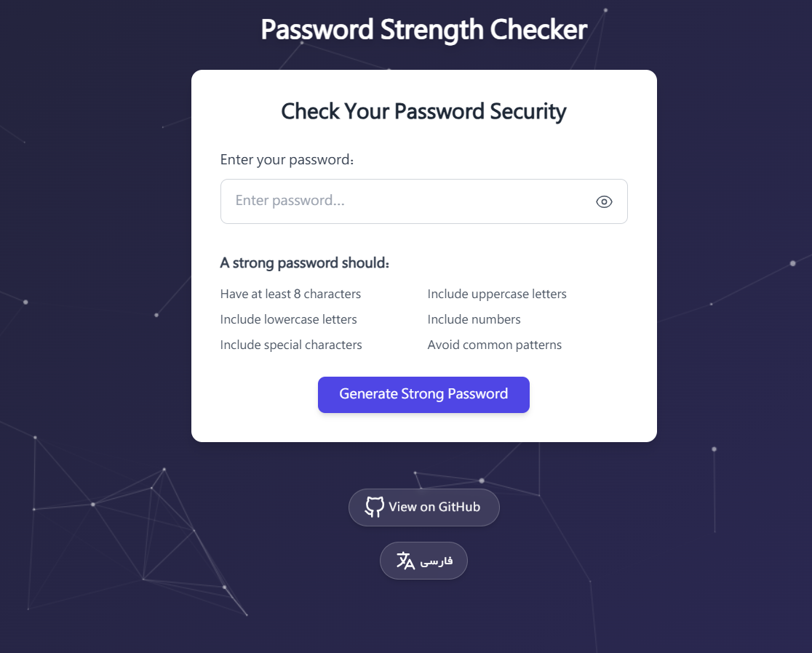

# Password Strength Checker | بررسی قدرت رمز عبور

<div align="center">


</div>

<div align="center">
  
  <p><i>🔒 Secure, Beautiful and Fast Password Strength Analysis</i></p>
</div>

> [English](#english) | [فارسی](#persian)

---

<a name="english"></a>
## 🇬🇧 English

### 📖 Overview

The Password Strength Checker is a robust web application designed to help users create and evaluate secure passwords. With an intuitive interface, it provides real-time feedback on password strength using multiple criteria including length, complexity, and common patterns.

### ✨ Features

- **Real-time Strength Analysis**: Instant visual feedback on password strength
- **Strong Password Generation**: One-click generation of cryptographically secure passwords
- **Detailed Feedback**: Specific suggestions for improving password security
- **Responsive Design**: Works on all devices - desktop, tablet, and mobile
- **Bilingual Support**: Full English and Persian language interfaces
- **Elegant UI**: Modern, animated interface with particles background
- **MVC Architecture**: Clean, maintainable code structure following best practices

### 🚀 Quick Demo

1. Enter your password in the input field
2. See real-time strength evaluation with color-coded indicators
3. Get specific feedback on how to improve your password
4. Click "Generate Strong Password" for an instant secure password

### 🛠️ Technologies Used

- PHP 7.4+
- HTML5 & CSS3
- JavaScript
- Tailwind CSS
- Particles.js
- MVC Architecture

### 📋 Requirements

- PHP 7.4 or higher
- Web server (Apache/Nginx)
- Modern web browser

### 📥 Installation

1. Clone the repository:
   ```bash
   git clone https://github.com/AdeptMehdi/password-checker.git
   ```

2. Place the project in your web server's document root (e.g., `htdocs` for XAMPP)

3. Configure the web server to point to the `public` directory

4. Open your browser and navigate to the application URL (e.g., `http://localhost/password-checker/public/`)

### 🔍 Project Structure

```
password-checker/
├── app/
│   ├── controllers/
│   │   └── PasswordController.php
│   ├── models/
│   │   └── PasswordModel.php
│   └── views/
│       ├── layout.php
│       └── password-checker.php
├── config/
│   └── config.php
├── public/
│   ├── check.php
│   ├── index.php
│   ├── js/
│   │   └── app.js
│   ├── standalone.php
│   └── test.php
└── README.md
```

### 🤝 Contributing

Contributions are welcome! Please feel free to submit a Pull Request.

### 📜 License

This project is licensed under the MIT License - see the LICENSE file for details.

---

<a name="persian"></a>
## 🇮🇷 فارسی

### 📖 معرفی

بررسی‌کننده قدرت رمز عبور یک برنامه وب قدرتمند است که برای کمک به کاربران در ایجاد و ارزیابی رمزهای عبور ایمن طراحی شده است. با رابط کاربری بصری، این برنامه بازخورد آنی در مورد قدرت رمز عبور با استفاده از معیارهای متعدد از جمله طول، پیچیدگی و الگوهای متداول ارائه می‌دهد.

### ✨ ویژگی‌ها

- **تحلیل قدرت بلادرنگ**: بازخورد تصویری آنی از قدرت رمز عبور
- **تولید رمز عبور قوی**: تولید رمزهای عبور ایمن با یک کلیک
- **بازخورد دقیق**: پیشنهادات مشخص برای بهبود امنیت رمز عبور
- **طراحی واکنش‌گرا**: کارکرد در تمام دستگاه‌ها - رایانه، تبلت و موبایل
- **پشتیبانی دو زبانه**: رابط کاربری کامل به زبان‌های فارسی و انگلیسی
- **رابط کاربری شیک**: رابط مدرن، متحرک با پس‌زمینه ذرات
- **معماری MVC**: ساختار کد تمیز و قابل نگهداری با استفاده از بهترین روش‌ها

### 🚀 نمایش سریع

1. رمز عبور خود را در فیلد ورودی وارد کنید
2. ارزیابی قدرت رمز عبور را بصورت آنی با نشانگرهای رنگی مشاهده کنید
3. بازخورد مشخصی دریافت کنید در مورد چگونگی بهبود رمز عبور
4. برای دریافت یک رمز عبور ایمن فوری روی "تولید رمز عبور قوی" کلیک کنید

### 🛠️ تکنولوژی‌های استفاده شده

- PHP 7.4+
- HTML5 و CSS3
- JavaScript
- Tailwind CSS
- Particles.js
- معماری MVC

### 📋 نیازمندی‌ها

- PHP 7.4 یا بالاتر
- وب سرور (Apache/Nginx)
- مرورگر وب مدرن

### 📥 نصب و راه‌اندازی

1. کلون کردن مخزن:
   ```bash
   git clone https://github.com/AdeptMehdi/password-checker.git
   ```

2. قرار دادن پروژه در روت سرور وب (مثلاً `htdocs` برای XAMPP)

3. پیکربندی وب سرور برای اشاره به دایرکتوری `public`

4. باز کردن مرورگر و مراجعه به URL برنامه (مثلاً `http://localhost/password-checker/public/`)

### 🔍 ساختار پروژه

```
password-checker/
├── app/
│   ├── controllers/
│   │   └── PasswordController.php
│   ├── models/
│   │   └── PasswordModel.php
│   └── views/
│       ├── layout.php
│       └── password-checker.php
├── config/
│   └── config.php
├── public/
│   ├── check.php
│   ├── index.php
│   ├── js/
│   │   └── app.js
│   ├── standalone.php
│   └── test.php
└── README.md
```

### 🤝 مشارکت

مشارکت‌ها خوش‌آمدند! لطفاً برای ارسال تغییرات، یک Pull Request ارسال کنید.

### 📜 مجوز

این پروژه تحت مجوز MIT منتشر شده است - برای جزئیات بیشتر به فایل LICENSE مراجعه کنید.

---

<div dir="ltr" align="center">
  <p>© 2023 <a href="https://github.com/AdeptMehdi">AdeptMehdi</a>. All rights reserved.</p>
</div> 